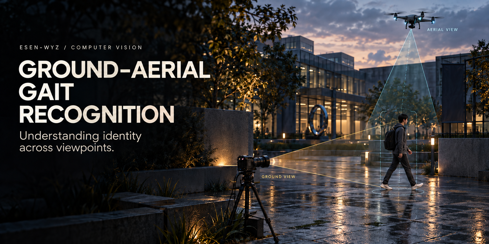

  

# Esen-wyz

**计算机视觉 · 步态识别 · 地空跨视角匹配**  
Computer Vision · Gait Recognition · Ground–Aerial Matching

I study **ground–aerial gait recognition**, with a focus on matching walking sequences captured from different heights and viewpoints. My research interests center on how human motion can provide identity cues across these changes in observation.

## Research interests

| Area | Research question |
| :--- | :--- |
| **Cross-view representation** | Which gait cues remain informative across ground and aerial views? |
| **Temporal information** | How can the structure of a walking sequence inform cross-view matching? |
| **Imaging conditions** | How do changes in scale, occlusion, and image quality affect recognition? |

[Repositories](https://github.com/Esen-wyz?tab=repositories)
