  

# Hi, I'm Esen-wyz.

**计算机视觉 · 步态识别 · 地空跨视角匹配**  
Computer Vision · Gait Recognition · Ground–Aerial Matching

我关注**地面与空中视角之间的步态识别**：当观察的高度、角度与尺度发生变化，如何从行走中提取稳定的身份线索？研究之外，也喜欢把好奇心写成一些能看、能玩、能交互的小东西。

*Exploring identity through motion, across ground and aerial views. Building little things out of curiosity along the way.*

[Research ↓](#01--research) · [After hours ↓](#02--after-hours) · [Explore my repositories ↗](https://github.com/Esen-wyz?tab=repositories)

## 01 / Research

### 换个视角，仍然读懂步态。

我的研究主线是 **Ground–Aerial Gait Recognition（地空步态识别）**。我关心一段行走序列中的运动信息，以及它如何跨越视角差异。

| 关注点 | 我想回答的问题 |
| :--- | :--- |
| **跨视角表征** · Across views | 从地面到空中，哪些步态线索能在视角变化后保持稳定？ |
| **时序建模** · Through time | 怎样利用连续行走中的动态信息，形成更有区分力的表征？ |
| **复杂条件** · In the wild | 当尺度、遮挡与成像条件改变，如何进行可靠的跨视角匹配？ |

> 从问题出发，用实验验证，让结论有据可循。

## 02 / After hours

  

研究之外，我也喜欢折腾视觉、空间和交互：一个突然冒出来的念头，一段让人会心一笑的小程序，或者一个值得亲手试试的“如果”。

**认真做研究，也给好奇心留一点自由活动的空间。**

<b>打开实验室抽屉 / Open the idea drawer</b>

 

- **Visual worlds** — 对场景、空间与视觉表达保持好奇。
- **Tiny interactions** — 做一点能点、能玩、能产生反馈的小东西。
- **Happy accidents** — 给那些“好像没什么用，但很有意思”的想法一次机会。

有些点子还在生长。等它们准备好了，再把故事慢慢讲出来。

 

  Different viewpoints. Shared curiosity. 
  在不同的视角里，保持同一份好奇。

